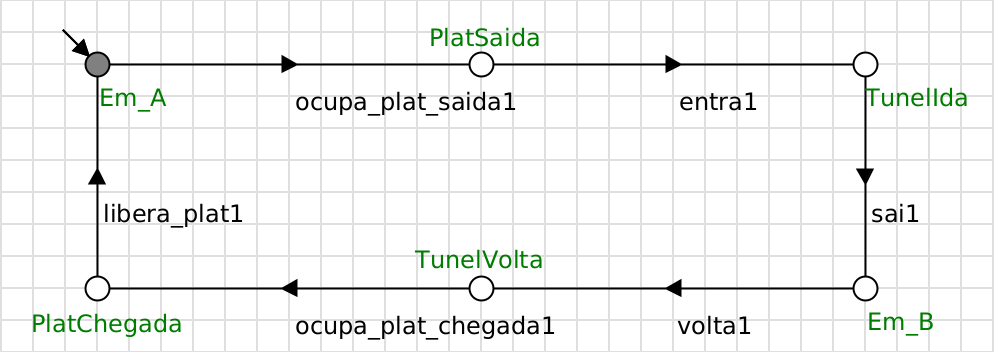
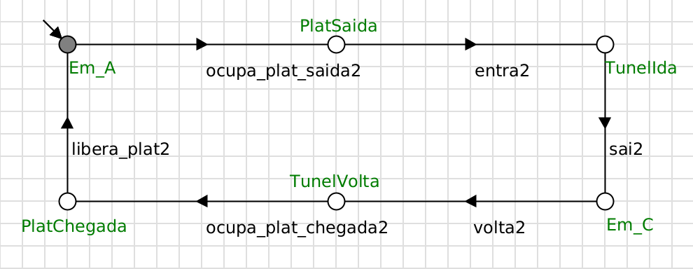
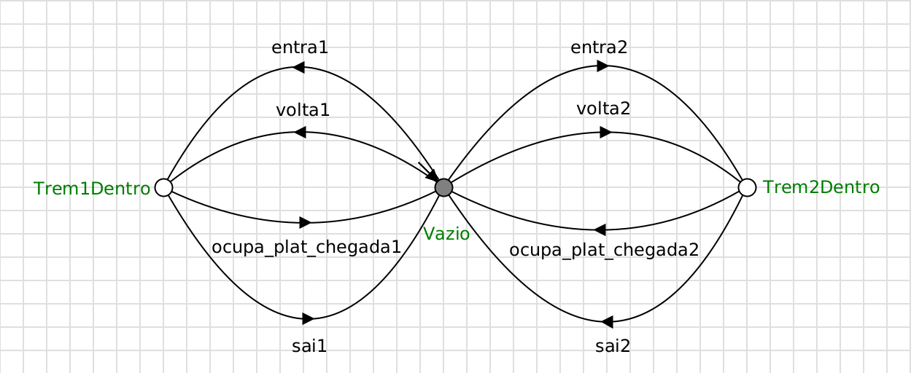
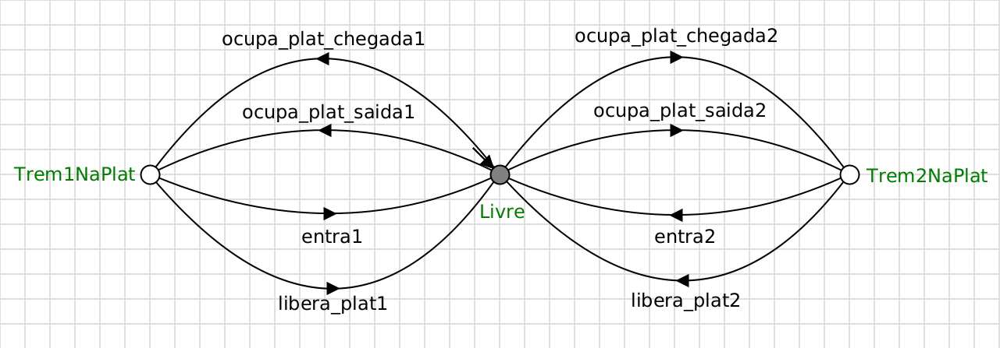
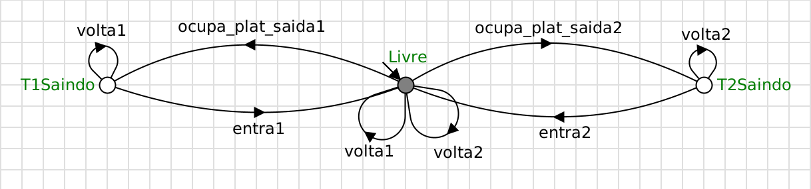
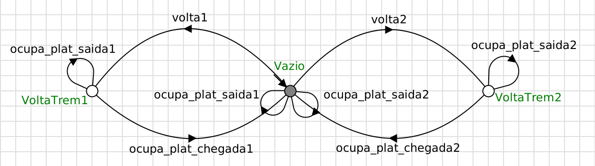
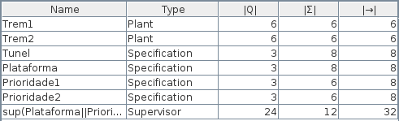

# Controle Supervisório de um Sistema Ferroviário com Recursos Compartilhados

Projeto da disciplina de **Sistemas a Eventos Discretos (SED)**, desenvolvido na ferramenta **Supremica** usando a Teoria de Controle Supervisório (autômatos finitos, síntese de supervisor).

**Aluna:** Gabriela de Sousa Andrade — Matrícula 121110619

**Vídeo de demonstração:** [https://youtu.be/9dBA4fnIx64?si=Xhm50QUceaMPCOru]

---

## 1. Visão geral do sistema

O sistema modela uma malha ferroviária com **três cidades** (A, B e C) e **dois trens**:

- O **Trem 1** faz o trajeto A ↔ B.
- O **Trem 2** faz o trajeto A ↔ C.

Os dois trens compartilham **dois recursos**:

- **Túnel:** um trecho de via única, usado pelos dois trens na ida e na volta. Cabe **apenas um trem por vez** (capacidade 1).
- **Plataforma:** localizada na cidade A, é ocupada por um trem tanto ao **partir** de A quanto ao **retornar** a A. Também comporta **apenas um trem por vez**.

O objetivo do projeto é sintetizar um **supervisor** que coordene o uso desses dois recursos, garantindo que o sistema opere com segurança e sem travar.

---

## 2. Conceitos de Controle Supervisório

O projeto aplica a Teoria de Controle Supervisório, na qual o sistema é modelado por dois tipos de autômato:

- **Plantas:** descrevem o comportamento físico do sistema — tudo que ele *consegue* fazer, inclusive situações indesejadas. Aqui, as plantas são o Trem 1 e o Trem 2.
- **Especificações:** descrevem as regras que se deseja impor (segurança e coordenação). Aqui, são o Túnel, a Plataforma, a Prioridade 1 e a Prioridade 2.

Os eventos se dividem em:

- **Controláveis:** podem ser habilitados ou desabilitados pelo supervisor (ocupar um recurso).
- **Não-controláveis:** ocorrem de forma autônoma e não podem ser impedidos (liberar um recurso, sair do túnel).

A partir das plantas e das especificações, o Supremica **sintetiza** automaticamente o supervisor: o controlador mais permissivo que mantém o sistema dentro das regras, **nunca desabilita um evento não-controlável** e é **não-bloqueante** (o sistema sempre consegue voltar a um estado marcado, sem deadlock).

---

## 3. Eventos do sistema

Cada trem possui seis eventos (sufixo `1` para o Trem 1, `2` para o Trem 2).

| Evento | Tipo | Significado |
|---|---|---|
| `ocupa_plat_saida` | Controlável | ocupa a plataforma de A para partir |
| `entra` | Controlável | entra no túnel (ida) |
| `volta` | Controlável | entra no túnel (volta) |
| `ocupa_plat_chegada` | Controlável | ocupa a plataforma de A ao retornar |
| `sai` | Não-controlável | sai do túnel no destino (B ou C) |
| `libera_plat` | Não-controlável | libera a plataforma e fecha o ciclo |

O supervisor atua **apenas nos eventos controláveis** — os pontos em que um trem tenta ocupar um recurso.

---

## 4. Modelagem — Plantas

### Trem 1

A planta do Trem 1 descreve seu ciclo completo: a partir de **Em_A** (estado inicial e marcado), o trem ocupa a plataforma para sair, entra no túnel, chega em B, retorna pelo túnel, atraca na plataforma e fecha o ciclo de volta em A.

### Trem 2

A planta do Trem 2 é idêntica à do Trem 1, mas no trajeto A ↔ C.

---

## 5. Modelagem — Especificações

### Túnel (capacidade 1)

Garante que **apenas um trem ocupe o túnel por vez**, evitando colisão. O estado **Vazio** é inicial e marcado; os estados `Trem1Dentro` e `Trem2Dentro` representam o túnel ocupado. Um trem entra no túnel por `entra` (ida) ou `volta` (volta) e o libera por `sai` (no destino) ou `ocupa_plat_chegada` (ao atracar em A).

### Plataforma (capacidade 1)

Garante que **apenas um trem ocupe a plataforma de A por vez**. O estado **Livre** é inicial e marcado. Um trem ocupa a plataforma por `ocupa_plat_saida` (ao partir) ou `ocupa_plat_chegada` (ao chegar) e a libera por `entra` (ao entrar no túnel) ou `libera_plat` (ao final do ciclo).

### Prioridade 1

Evita que **um trem volte pelo túnel enquanto o outro está na plataforma esperando para sair**. Enquanto há um trem no estado "saindo" (`T1Saindo` ou `T2Saindo`), o evento `volta` do outro trem fica desabilitado. Os laços (self-loops) mantêm os eventos `volta` no alfabeto da especificação para que possam ser controlados.

### Prioridade 2

Evita que **um trem ocupe a plataforma para sair enquanto o outro está no túnel voltando**. Enquanto há um trem no estado "voltando" (`VoltaTrem1` ou `VoltaTrem2`), o evento `ocupa_plat_saida` do outro trem fica desabilitado.

---

## 6. Problemas evitados pelo supervisor

Sem um supervisor adequado, o sistema está sujeito a duas falhas:

### Colisão

Dois trens dentro do túnel ao mesmo tempo. Evitada pela especificação do **Túnel** (capacidade 1).

### Deadlock (espera circular entre os recursos)

Por usarem **dois** recursos que se interligam (o evento de atracar na chegada libera o túnel e ocupa a plataforma), os trens podem entrar em espera circular:

- um trem está no **túnel voltando** e precisa da **plataforma** para atracar;
- o outro trem está na **plataforma para sair** e precisa do **túnel** para partir;
- nenhum dos dois libera o recurso que possui, e o sistema trava.

Esse deadlock pode ser alcançado por dois caminhos simétricos, que são prevenidos pelas duas especificações de prioridade:

- **Prioridade 1** impede que o segundo trem entre no túnel (volta) quando o primeiro já está na plataforma de saída.
- **Prioridade 2** impede que o segundo trem ocupe a plataforma de saída quando o primeiro já está no túnel voltando.

Com as duas regras, a combinação que levaria ao deadlock nunca é alcançada.

---

## 7. Síntese do supervisor

A síntese foi realizada no Supremica a partir das **2 plantas** e das **4 especificações**, com a propriedade *nonblocking and controllable* e o algoritmo *Monolithic (explicit)*.

O supervisor resultante possui **24 estados, 12 eventos e 32 transições**. Como o número de estados é maior que zero, existe um supervisor válido — o sistema é controlável e não-bloqueante.

A ausência de deadlock foi confirmada formalmente pela verificação `Deadlock Check` do Supremica, que retornou **"Model trens_tunel is deadlock free."**.

---

## 8. Simulação e validação

O comportamento foi validado na aba **Simulator** do Supremica, com todos os autômatos ativos (incluindo o supervisor). A simulação demonstra que:

- não é possível colocar dois trens no túnel ao mesmo tempo;
- o supervisor desabilita preventivamente os eventos que levariam à espera circular;
- a partir de qualquer estado, os trens sempre conseguem completar seu ciclo e voltar a circular (não-bloqueio).

---

## 9. Como reproduzir

1. Instale os pré-requisitos:
   - [Supremica IDE 2.7.1](https://github.com/robimalik/Waters/releases)
   - [Java (JRE)](https://www.oracle.com/java/)
   - [Graphviz](https://graphviz.org/)
2. Abra o arquivo `trens_tunel.wmod` no Supremica (`File → Open`).
3. Na aba **Analyzer**, selecione todos os autômatos e use `Analyze → Synthesis → Synthesize Supervisor` para gerar o supervisor.
4. Use `Verify → Controllability and nonblocking` para confirmar a ausência de deadlock.
5. Na aba **Simulator**, ative todos os autômatos e explore os cenários.

---

## 10. Arquivos do repositório

- `trens_tunel.wmod` — modelo completo no Supremica (plantas, especificações e eventos).
- `figuras/` — figuras dos autômatos e dos resultados.
- `README.md` — esta documentação.
